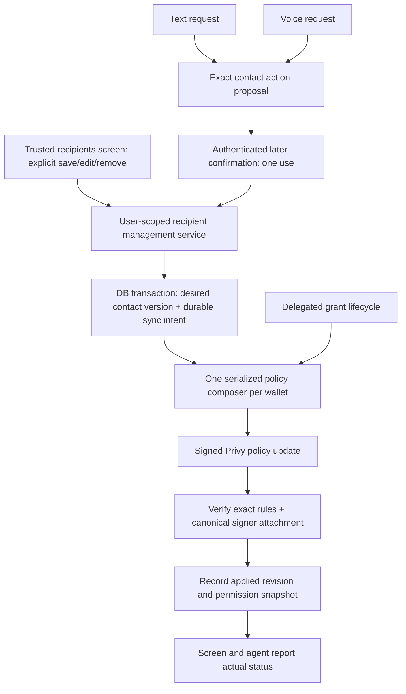

# Proposed design — revision 1

Status: proposed; no implementation approval. User requested mapping including agent operation.

## Desired flow

## Common application boundary
UI HTTP handlers and agent tools call the same recipient management service. Existing repositories remain persistence adapters. Confirmed fact memories keep their separate path: saving a fact never expands payment permissions. Server binds user/wallet/network; model supplies neither policy ID, signer ID, cap, nor network. All recipient addresses validate as Solana; no new chain selector.

For agent add, reuse staged memory intent where viable but route recipient writes through the common service. Add version-bound proposals for edit/archive, resolving ambiguous names first. Draft identifies operation, name, exact address (old/new for edits), and authorization effect. Voice should obtain addresses from pasted/scanned input or an existing verified source where possible, never infer an address from a name. Exact address is available visually; spoken summary plus explicit confirmation must reference that same immutable proposal. If the address cannot be verified, ask for it rather than create permission.

Text and voice evidence must be tied to contact-action ID and user, after proposal creation, expiring and consumed once. Extend the existing evidence mechanism coherently rather than letting a model-provided confirmation ID count as consent. Final transcript delay must be handled as in the working transfer gate. A contact confirmation cannot consume or authorize a pending transfer, and vice versa. Do not depend on persisted voice user turns; current voice does not provide them. Concurrent pending action ambiguity must fail closed until the user selects the intended action.

## Persisted desired state and remote application
Recommend durable sync intent in the same transaction as contact changes, followed by an immediate bounded synchronization attempt. Normal save returns enabled immediately after readback; failures return a saved-but-pending/error status and retry from durable intent. A DB transaction plus HTTP PATCH cannot be atomic: rolling back only DB after a timeout could leave an unrecorded remote authorization. Keep explicit desired/applied revisions and operation idempotency instead.

Suggested logical states: no active wallet/permission (saved, not enabled), pending, syncing, applied, retryable error, blocked configuration/conflict. A timeout means outcome unverified, not definite rejection; read remote before repeating update. UI and agent distinguish contact storage from permission readiness. A pending removal must say that remote revocation is not yet verified. Persist operation origin, contact version, desired revision, attempt/error classification, and verified policy hash without transcripts or secrets.

Use cross-process wallet serialization (DB-backed ownership/lease with revision checks), not only an in-memory mutex: HTTP backend and voice worker are distinct processes. During readback, if desired revision changed, do not mark newer intent applied; recompute. Reconciliation resumes after restart and handles known local/remote drift using approved source data. Unknown remote rules/attachment/owner changes block rather than silently deleting permissions. Provider must still enforce policy; synchronization readiness is lifecycle bookkeeping, not a reinstated local transfer-policy gate. An unverified deletion cannot be advertised as revoking raw signer authority.

## One policy composer
One owner composes the complete attached policy from the enrollment permission plus active delegated grants. All contact, enrollment, grant creation/revocation/expiry, and retry paths use it. Keep policy ID, canonical signer, unrelated signers, ownership, approved limits and expiration semantics. Ordinary trusted-contact transfers retain the 10,000,000 lamport cap. Do not silently change already approved delegated limits or make adding a contact create an automatic-payment grant.

Base rule recipients = active, explicitly confirmed Solana trusted addresses plus any explicitly consented retained baseline address (current self address must not disappear accidentally). Do not reinterpret old EVM/null-network recipients as Solana. Same address in multiple active contacts is deduplicated; removing one alias does not revoke another active alias. Editing name/description does not broaden remote permissions; address edit invalidates old selections/previews and recomposes old/new addresses.

Last trusted recipient removal removes its base ALLOW contribution; preserve unrelated baseline permission and unaffected grants. If composition becomes empty, verify provider deny behavior and represent it with an explicitly supported deny policy or signer permission revocation; never detach a restrictive policy in a way that makes the signer unrestricted.

Delegated policy composition is a required integration boundary, not an unrelated grants redesign: current full-rule PATCH would erase new base rules. Removing a recipient with active delegated grants needs the user decision below; address replacement also cannot silently migrate grants to a new address.

## Runtime and API map
- Backend and worker get the same injected management service and policy capability.
- Provision backend access to an authorization signer through the existing opaque secret mechanism; worker loopback URL is not reachable from backend namespace. Choose deployment wiring after inspecting compose topology; never put a private key in frontend or general application containers.
- Update duplicated backend/frontend HTTP types for permission sync status/revision and conflict errors; frontend MSW fixtures and invalidation follow the same contract.
- Contact list shows enabled/pending/not configured/error; save/remove and agent replies report verified outcome. No success toast or spoken “habilitado” before remote readback.
- Reconcile enrollment's persisted allowlist/policy hash only after matching applied revision; resolve Test1's existing drift through this same reconciler rather than a one-off DB patch.

## Validation map (planned, not executed)
- Unit: Solana draft validation, shared service, composer, duplicate aliases, unchanged cap, empty set, action-bound one-use evidence, stale/foreign proposal.
- Adapter with fake transport: real signed Privy adapter issues valid PATCH and verifies rules/signers; policy denial, timeout before/after update, mismatched GET, unknown rules, signer unavailable.
- DB integration: atomic contact+intent, idempotent retries, two processes, newer revision during sync, restart recovery, isolated users, obsolete contact version.
- Screen E2E: create/edit/remove -> API -> DB -> real adapter over fake transport -> verified state; reload displays same state.
- Agent E2E: text and LiveKit session add/edit/remove, authenticated final agreement, delayed final transcript, cancellation, no speech, no cross-confirming transfer; same remote policy as UI.
- Live: provision backend signer safely; create an explicitly user-selected devnet contact through screen and agent separately; verify attached policy and status. No money movement needed for policy writes. Any transfer proof remains separately confirmed by user and <=0.01 SOL. Revocation cannot be claimed solely from HTTP success.
- Backend/frontend lint, typecheck, tests, builds; agent evals. Compare failures with baseline and report skipped real-mode checks. No push/PR.

## Tradeoff
A synchronous-only contact PATCH is smaller but loses recovery and truthful state after timeout/restart. Durable intent plus immediate attempt meets normal immediacy while preserving evidence. Separate composers are rejected because complete-rule updates race and overwrite permissions.

## Open controlling decision
Q1: Removing the last active contact for an address also revokes its delegated automatic-payment grants, or preserves them with an explicit warning? Recommendation: revoke them so removal means withdrawal of trust. Asked in chat; response pending. Address edits should retire old-address grants under that same approved semantics rather than transferring them.

## Gate record
Gate ID: trusted-recipient-design-r1
Decision / allowed mutation: review this proposed integrated design; no code or remote mutation yet.
Explicit exclusions: changing caps, unrelated refactor, credentials, transfers, push/PR.
Owning artifact / revision: this file, revision 1.
Decision owner: Ramiro.
Approved by / trusted identity: mapping requested; design approval pending.
Status: proposed.
Invalidated by: removal-semantics answer or other scope/design revision.

After Q1 and design approval: draft vertical implementation outline, independent Pi review under the RPI skill, explicit outline approval, then SDD. No outline created while Q1 is unresolved.
