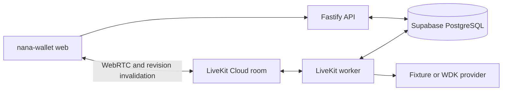
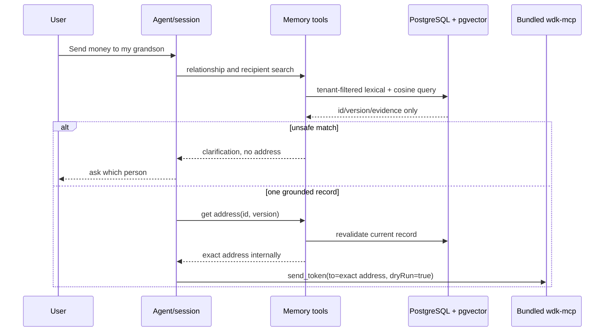

# Nani architecture and evidence boundaries

## Independent processes

Fastify (`dist/server.js`) and the LiveKit worker (`dist/livekit/worker.js`)
are separate processes. Fastify owns HTTP, the server-resolved identity,
short-lived Ed25519 bindings, canonical projections, and touch decisions. The
worker owns room jobs, media lifecycle, and the voice adapter. Both use the
same Supabase PostgreSQL schema and tenant-scoped `recipient_app` role.

The worker is started only after `LIVEKIT_URL`, LiveKit API credentials, the
binding public key, database identity, and the OpenAI API key validate. It stops
accepting jobs, drains registered financial tasks for the configured bounded
interval, closes wallet and memory providers, and closes PostgreSQL last. A
task that exceeds the drain deadline remains durable and fail-closed; it is
reconciled rather than broadcast again.



## Media and privacy boundary

The application creates no recordings, persists no microphone or synthesized
audio, and configures `record: false` for AgentSession. LiveKit Egress and
automatic Egress remain disabled. Live voice runs as a single OpenAI Realtime
(GPT-Realtime) speech-to-speech session: transcription, inference, and speech
generation happen inside the model session, with no intermediate STT/TTS
providers. OpenAI audio retention follows the account's API data terms.

Voice metrics contain only aggregate phases, counts, and latency summaries.
Detailed traces require `VOICE_TRACE_ENABLED=true`, are redacted before
storage, and expire after at most seven days. Production additionally requires
an explicit privacy approval, destination, access role, and deletion
mechanism. Raw audio, provider payloads, secrets, addresses, names, tokens,
amounts, and balances are never trace fields.

## Realtime voice and confirmation boundary

Live voice is a single OpenAI Realtime speech-to-speech session
(`gpt-realtime-2.1-mini`, default voice `marin`) created in the worker from
`OPENAI_API_KEY`. The voice path uses no Deepgram STT, no silero VAD, and no
`WalletConversationLLM`: transcription, inference, and speech
generation happen inside the Realtime model session, and the LiveKit session is
started with `record: false`.

The session is bound to one conversation through the worker's `bind_conversation`
gate. The worker builds a per-binding `WalletConversationService` so the voice
path's memory runtime scopes to the binding user (`binding.sub`), never the demo
tenant. This is the REVIEW FIX V3 wiring: the worker feeds the memory runtime into
the conversation service dependencies so `isClaimedRecipientValid` can revalidate
versioned recipients instead of always returning false. The voice path therefore
never reuses the demo-tenant text service.

### Realtime function tools

`createRealtimeTools` closes over the per-binding wallet, memory, and service so
each room resolves the correct tenant without a global lookup. Five model-facing
tools are exposed:

- `get_balance` — reads the configured wallet balance through `WalletProvider`.
- `search_recipients` — searches `RecipientMemoryService` scoped per binding user
  (`binding.sub`); returns address-free candidates and fails closed to
  `unavailable` when memory is missing.
- `send_token` — preview-only. The strict zod schema accepts only
  `{ amount, recipientId, recipientVersion, memo? }` and rejects any unknown field,
  so a model can never pass `dryRun`, a free-form `to` address, network, token, or
  wallet. It delegates to the per-binding service's `previewTransfer`.
- `confirm_transfer` / `cancel_transfer` — call the service `resolveDecision` with
  the *current* persisted `previewId` read at call time (REVIEW FIX V1), so a
  superseded or cancelled preview fails closed to `stale_preview` instead of
  broadcasting.

### Financial invariants

The text path and the voice path are not separate: they share the same repository,
wallet, and `FinancialTaskRegistry`, so the voice tools and the frontend
Confirm/Cancel card arbitrate on the same database claim.

- A preview is persisted through the PostgreSQL repository as a `pendingTransfer`
  on `conversation_state` plus a row in `conversation_transfer_attempts` (`status`
  in `previewed`/`broadcasting`/`submitted`/`uncertain`). The unique partial index
  `conversation_one_active_transfer_idx` enforces at most one active transfer per
  conversation.
- Revisions are published through `financialTasks` and the progress publish path,
  then delivered to the room as `conversation_state_changed` data on the
  `conversation_state_changed` topic, so the frontend card appears without any
  publish logic living in the LiveKit tool layer.
- Confirming or cancelling by voice (`confirm_transfer` / `cancel_transfer`) and
  by the frontend Confirm/Cancel card both go through `resolveDecision`, which
  revalidates the selected recipient, applies the wallet policy, and claims the
  transfer in `conversation_transfer_attempts` — the same compare-and-set claim
  used by `POST /v1/conversations/:conversationId/decisions`. A stale preview,
  repeated decision, or uncertain broadcast returns `accepted: false` and never
  starts another broadcast.

## Recipient address memory boundary

Recipient references are durable application data in Supabase PostgreSQL 17 + pgvector,
not model context. `recipients` stores a versioned exact address payload with a
384D embedding of normalized name + description only; `user_memories` stores
confirmed relationship facts with a 384D fact embedding. The pinned local
model is `sentence-transformers/paraphrase-multilingual-MiniLM-L12-v2` via
Transformers.js, so retrieval needs no hosted embedding credential.

Every repository transaction applies the server-owned demo tenant UUID and
sets PostgreSQL RLS context under the restricted `recipient_app` role. Search
uses tenant-filtered lexical name boost plus cosine similarity and returns only
candidate metadata. A score threshold/margin or duplicate exact name produces
clarification, never an inferred address. The fixed `DEMO_USER_ID` is only a
hackathon identity seam; production must replace it with an authenticated
principal.



Writes use `stage_user_memory` followed by a session-bound, single-use,
five-minute confirmation. The draft is the only point at which an exact new
address can be shown for explicit user approval. Session inspection, candidate
search, embeddings, and release evidence redact or omit addresses. Before the
WDK preview and again before broadcast, the recipient ID/version/address are
revalidated; any mismatch clears both selection and pending approval.

This implementation proves the Track 1 integration boundary with the scoped
`@tetherto/wdk-cli@1.0.0-beta.2` package and direct
`@tetherto/wdk@1.0.0-beta.14` dependency. It requires Node.js `>=22.18.0`.
`wdk-mcp`, bundled by the scoped CLI package, is the only agent-facing wallet
boundary. The client starts its fixed installed executable through the official
MCP stdio transport; it does not parse CLI output or embed a toolkit.

The pinned CLI package requires its documented postinstall step to install the
wallet modules listed in its bundled configuration. `package.json` therefore
records npm approval only for the exact pinned CLI package and pins
`@tetherto/wdk-wallet-evm@1.0.0-beta.11` directly for the CLI's Sepolia
configuration. This is package installation, not wallet administration: it
never creates, imports, unlocks, funds, or deletes a wallet. The direct core
dependency is `@tetherto/wdk@1.0.0-beta.14`; the installed CLI beta.2 has its
own internal `@tetherto/wdk@1.0.0-beta.6` dependency, so the two versions must
not be treated as interchangeable runtime proof.

## Asset and network

The product asset is the registered Sepolia token slug `usdt` (test USD₮).
Sepolia ETH is gas only and is never a product-transfer fallback. The raw MCP context retains network, token,
recipient, decimal amount, `baseUnits`, wallet/index, `dryRun`, fee or gas
fields, result, error, transaction hash, and verification state. The agent and
HTTP layers use those fields to implement confirmation and session contracts;
this module intentionally makes none of those product decisions.

## Lifecycle and evidence

1. A human creates, backs up, funds, unlocks, and finally locks a dedicated
   limited-funds test wallet outside this repository, with a finite TTL.
2. `WdkMcpClient` launches the installed `wdk-mcp` with a small allowlisted
   environment, bounded handshake/call timeouts, stderr capture, and one-shot
   process lifecycle. A failed or uncertain call is closed and never retried.
3. Discovery captures raw tool names and schemas. Reads capture raw address,
   USD₮ balance, and history. History is explicitly classified as unavailable,
   stale, empty, or non-empty; unavailable and stale are never converted to
   empty.
4. A human-provided candidate invokes `send_token` with `dryRun: true` first.
   The preview evidence links recipient, token, amount, network, and fee while
   proving broadcast count zero.
5. Only a separately approved human operation can run the matching
   `dryRun: false` call. It is limited to one Sepolia USD₮ broadcast and must
   preserve the real hash plus explorer/history verification or its explicit
   unavailability. The repository does not run this command automatically.
   If a `dryRun: false` request times out or WDK returns `isError: true`, the
   client records a sanitized failure envelope with the original input, one
   attempted call, no hash, and `verification: uncertain`; it never retries.
6. The operator locks the wallet or lets its TTL expire, then captures a
   protected-call failure. No seed phrase, passphrase, private key, API key,
   credential, or configuration value is accepted in fixtures, errors, logs,
   or evidence.

## Safe manual harness

The normal test suite does not contact a wallet. The optional manual read and
preview harness requires `WDK_LIVE=1` plus an operator-supplied recipient and
small USD₮ amount; `WDK_TEST_TOKEN`, when present, must be exactly `usdt`. A broadcast is additionally gated by both
`WDK_ALLOW_BROADCAST=1` and `WDK_BROADCAST_APPROVED=1`; it is intentionally
not a CI command. Run artifacts in `tests/integration/wdk-fixtures/` are
templates, not a claim that a wallet, preview, or broadcast has occurred.

`npm run test:e2e:wdk-mcp` is a separately opt-in, wallet-free connectivity
check. It starts the bundled `wdk-mcp` through `WdkMcpClient`, completes stdio
initialization, discovers the Track 1 tools, calls only `get_networks` and
`get_token` for built-in Sepolia `usdt`, validates their raw MCP content shape,
and closes the process. It never creates, imports, unlocks, exports, deletes,
or funds a wallet, and never calls `send_token`.

These environment gates are harness controls, not daemon authorization. The
bundled CLI documentation states that an unlocked wallet can broadcast a valid
`dryRun: false` request without another daemon passphrase prompt, so the wallet
must be dedicated, limited-funds, same-user-access aware, and locked at the
end of the session.

Indexer configuration is never inherited from the process environment. The
installed CLI beta.2 reads the indexer base URL from its WDK CLI configuration,
so a host must configure that durable setting through the human-operated CLI
path. A host that has authorization to supply an indexer key may inject only
`WDK_INDEXER_API_KEY` explicitly into this client; the module never logs that
value and sanitizes authenticated URLs, query parameters, and authorization
tokens before evidence persistence.

## Deliberate Track 1 boundary

This project uses the ready-made CLI daemon and bundled `wdk-mcp` server. The
WDK MCP Toolkit is a different package for building a custom MCP server with
selected or custom tools, so it is intentionally out of scope. WDK agent
skills are instructional context, not this application's wallet boundary.
Neither x402 nor OpenClaw integration is part of this Developer 1 work unit.

## Failure and handoff contract

Failures retain their stage (`handshake`, `connection`, `discovery`, `call`,
`validation`, or `closure`), a sanitized message, and broadcast status.
Sensitive-shaped evidence is rejected before persistence. Fixtures use
`wdk-evidence/v1` and preserve raw WDK outcome shapes rather than a normalized
product contract. The application must treat fixture status and live evidence
as authoritative and must not infer a successful transaction from a preview,
unavailable indexer, or a missing hash.

Every fixture must contain `status`, recipient, token, amount, fee, and error
fields. The checked-in fixtures deliberately use `not-run`/blocked status and
null live values, so they cannot be mistaken for a real wallet result.

## Wallet policy lock order

Every transaction that decides whether money moves — the delegated-grant claim,
the recipient mutation, the policy apply, the reconciliation — touches the same
few rows in PostgreSQL. Two of them can run at the same time on the same wallet,
so the order in which they take their locks is not a style choice: it is what
decides whether PostgreSQL can find a cycle and abort one of them with `40P01`.
A `40P01` on the claim path is a refused payment the user did not cause, so this
section defines ONE order and every writer follows it. Do not add a lock without
re-reading this section.

### The canonical vector

```text
W1 → W0 → L1 → L2 → L3 → L4 → L5 → R
```

Slot by slot:

```text
W1   recipient_policy_leases      the wallet's serialized writer: a row lease held
                                  in its own short transaction, NEVER nested inside
                                  another transaction and never held across remote I/O
W0   recipient_policy_state       FOR SHARE in read/claim transactions,
                                  FOR UPDATE in the applying transaction
L1   advisory xact  dgc-grant-<id>  one per grant, ASCENDING id
L2   row lock       delegated_grants  FOR UPDATE, ascending id
L3   row lock       recipients         FOR UPDATE, ascending id
L4   advisory xact  dgc-wallet-<id>   legacy shim, kept only for compatibility
L5   appends        grant_audit_log / grant_claim_ledger / recipient_policy_state /
                    recipient_policy_sync_intent / contact_action_proposals /
                    recipient_policy_audit
----- transaction boundary -----
R    provider I/O (createPolicy / patchPolicy / getPolicy / getWallet), strictly
     AFTER commit
```

`R` is not a lock: it is the transaction boundary written down so no writer keeps
one open while it waits on the provider.

`LX` is a separate, user-scoped order:

```text
LX   advisory xact  nana-wallet-sync:<userId>   wallet sync only, touches no grant
                                                or recipient row (src/wallet/embedded.ts)
```

### The two rules

1. **A policy-affecting writer takes `W1` first.** Any writer that must take
   `L1..L5` either holds the wallet lease (`W1`) or is a read/claim path that
   takes `W0` in `FOR SHARE` mode.
2. **No transaction ever takes a lower-numbered lock after a higher-numbered
   one.** Chains may skip slots and may repeat a slot; they may never go
   backwards. This is what makes the order total, and a total order is what makes
   acquisition monotone — and monotone acquisition is deadlock-free *by
   construction*, not by luck.

### Why `W0` precedes `L1` — the one decision that was actually wrong

The apply and removal transactions take `recipient_policy_state` `FOR UPDATE`
(`W0`) and *then* lock the grant rows (`L1`/`L2`). The claim transaction already
took the grant rows (`L1`/`L2`) as its first act. Left alone, the two chains are:

```text
apply  : W0  →  L2          (state first, then the grant row)
claim  : L1  →  L2  →  W0   (grant row first, then the state row)   ← the cycle
```

If the claim's state read came last, apply would hold the state row and wait for
the grant row while the claim held the grant row and waited for the state row:
the classic two-resource cycle. PostgreSQL resolves it by aborting one
transaction with `40P01`, which on the claim path means a payment refused for no
reason the user can see.

The fix is a **prepend, not a reorder**: the claim opens with the state read in
the `W0` slot, before `L1`. Both chains then run in one direction
(`W0 → L1 → L2`), `W0` is first in all of them, and the cycle cannot be formed.
This is the single most important ordering decision in the change, which is why
`tests/unit/lock-order-vector.test.ts` asserts the *position* of that statement
in the source and `tests/integration/lock-order-concurrency.test.ts` asserts the
absence of `40P01` under two real connections.

The same reasoning is why no new lock may be *inserted* between `L1` and `L2`:
the invariant that already held everywhere — grant advisory lock before grant row
lock — is what the rest of the analysis leans on. New locks are prepended or
appended, never inserted.

### The `LX` rule

`LX` is user-scoped (`nana-wallet-sync:<userId>`) and used only by the wallet sync
path, which touches no grant and no recipient row. No current path nests `LX`
with `W1..L5`, so the two orders never meet. If a future path needs both, the
order is:

```text
W1 → LX → W0 → L1 → L2 → L3 → L4 → L5
```

and the lock-order test must be extended to assert it. Until then, do not take
`LX` inside a transaction that also takes a `W`/`L` slot.

### Per-writer chains

Each chain is a subsequence of the canonical vector, which is exactly why no
cycle exists. `L5` appends are listed for completeness but are not locks the order
constrains.

```text
claim            : W0(S) → L1 → L2 → L5
                   src/wallet/grants/consumption.ts (claimConsumption). The W0
                   read is the prepend described above.
settle/revoke    : L1 → L2 → L5
                   consumption.ts (settleGrantReservation, revokeGrant). They
                   need no W0, so they skip it rather than take it late.
grant sync       : L1 → L2 → L4 → L5
                   src/wallet/grants/privy-policy-sync.ts (syncGrant,
                   syncRevocation). The dgc-wallet advisory is the legacy L4
                   shim; slice 1 routes these paths through the composer, and
                   the shim goes away with them.
removal          : W1 → tx{ W0(U) → L1(all affected, asc) → L2 → L3 → L5 } → R
                   src/wallet/policy/service.ts (remove → applyRemoval). W1 is
                   held OUTSIDE the transaction so it is never held across
                   provider I/O, and it is what makes this removal the wallet's
                   serialized writer.
create/edit      : tx{ W0(U) → L3 → L5 } → R
                   service.ts (runMutation). Takes W0 first for the same reason
                   as the claim: it locks the state row and then the contact row.
enrollment       : tx{ W0(U) → L5 } → R
                   service.ts (recordEnrollmentIntent).
apply/reconciler : W1 → tx{ W0(U) → L2 → L5 } → R
                   the single writer of the applied revision (arrives in slice 2).
contact mutation : L3
                   src/memory/contacts-repository.ts (update, archive).
wallet sync      : LX = nana-wallet-sync:<userId>
```

### Claim against removal, and revoked scopes

The removal takes the same locks in the same order plus `L3` after `L2`, so it
cannot form a cycle with a claim. The ordering between them is resolved by `L1`
contention instead of by a deadlock: a concurrent claim on the same grant either
completes first — and the removal then observes `state='revoked'` and skips it —
or blocks until the removal commits and then sees the revoked scope and refuses.
**A claim can never succeed against a revoked scope**, and that is asserted under
two real connections in `tests/integration/lock-order-concurrency.test.ts`.

### Where the `lease_reclaimed` audit belongs

`lease_reclaimed` is audit §5.2 step 3 of the design: the reconciler's
restart-recovery branch, which finds an intent whose lease holder expired and
reclaims it. It is **not** a claim-path audit — the claim path holds no lease and
no intent — and it must not be added here. When slice 2 implements it, the append
needs an explicit system-context policy on `recipient_policy_audit`: the table is
owner-only today, so an anonymous system transaction would be RLS-denied. That
requirement is recorded rather than pre-emptively granted, so no authority is
added that the design does not describe.
