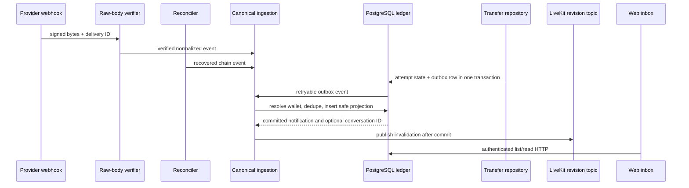

# Design: Durable wallet and assistant notifications

## Technical Approach

Add a PostgreSQL inbox and shared ingestion for assistant transfers, signed webhooks, and Solana reconciliation. Assistant states persist in `conversation_transfer_attempts`; a transactional outbox captures each notification-worthy transition. A retrying dispatcher commits notification insertion and outbox completion atomically, deduped by attempt ID + state. `wallet_operations` is a separate pipeline. Authenticated HTTP serves the feed; LiveKit only invalidates after commit.

## Architecture Decisions

| Decision | Choice | Tradeoff |
| --- | --- | --- |
| Source / delivery | PostgreSQL feed; HTTP reads, LiveKit invalidates | Process events are transient; native push excluded |
| Ingestion | Shared normalizer and DB dedupe | Avoids divergent webhook/poll semantics |
| Verification | Raw-byte signature check before parsing | Parsed-body verification changes signed bytes |
| Recovery | Per-wallet cursor with bounded overlap | Webhook-only misses delivery; balances lack identity |
| Provider scope | Enable verified embedded-wallet events only | Server-wallet docs do not prove embedded coverage |
| Assistant durability | Transactional outbox with each attempt update | Avoids post-commit crash gap |
| RLS | Owner-only feed; separate worker policies | Same owner policy blocks global workers |
| Send failure | Skip retryable `not_dispatched`; notify `uncertain` | No dispatch vs. possibly moved funds |

Per-table RLS details and the 30-second feed interval / 300-second Svix timestamp window are fixed below and in the design decisions table above.

### RLS surface (implemented in migration 013)

- `wallet_notifications`: owner-only (`app.user_id = user_id`); system (anonymous) context matches no row.
- `provider_webhook_receipts`, `reconciliation_cursors`, `reconciliation_leases`: system-context-only — access only while `app.user_id` is unset/empty; every user context is denied.
- `assistant_lifecycle_outbox`: dual policy — the resolved owner's transaction writes attempt-transition events; the anonymous dispatcher enumerates and completes pending events.
- `user_wallets` (additive to migration 006): a `FOR SELECT` policy allows anonymous system transactions to resolve enrolled Privy wallet identity fields for exact webhook account/address binding and reconciliation. Ordinary owner-scoped policy is unchanged: no user-context cross-owner reads or writes.

## Data Flow

Advance cursors only after events are durable. Dedupe chain events by network/wallet/signature/class, webhooks by provider/account/delivery ID, and assistant states by attempt ID/state. Overlap permits safe page retry; a DB lease excludes duplicate wallet runs. Verify RPC retention and rate limits before rollout.

## File Changes

| File | Action | Description |
| --- | --- | --- |
| `src/db/migrations/013_wallet_notifications.sql` | Create | Feed/outbox/receipt/cursor tables, RLS |
| `src/notifications/*`, `src/api/notifications.ts` | Create | Normalize, ingest, reconcile, feed/read routes |
| `src/api/provider-webhooks.ts`, `src/server.ts` | Modify | Raw-body ingress and lifecycle wiring |
| `src/conversations/postgres-repository.ts` | Modify | Atomic assistant outbox writes |
| `src/wallet/solana-devnet-provider.ts` | Modify | Confirmed history pages |
| `apps/nana-wallet/src/features/notifications/*`, `src/lib/api.ts` | Create/Modify | Feed client and UI entry point |

## Interfaces / Contracts

- Feed includes ID, status, safe projection, timestamps, read state, optional devnet link.
- Invalid signatures have no side effects; scoped webhook and `(user_id, dedupe_key)` replays are no-ops, with fan-out only by the insert winner.
- Ingestion resolves internal owner/wallet; payload user IDs are ignored. Cursors use signature boundaries with overlap.

## Testing Strategy

| Layer | What to Test | Approach |
| --- | --- | --- |
| Unit | Signatures, normalization, dedupe, projection, cursors | Vitest RED tests |
| Integration | RLS, wallet resolution, replay/race, cursor retry, outbox recovery | PostgreSQL, two users, fake sources |
| E2E | Transfer/inbound feed without reload; voice refresh | Browser + fake provider; no funds |

## Threat Matrix

N/A — no routing to external shell commands, subprocesses, VCS automation, executable classification, or process integration is added. The reconciler performs bounded provider/RPC HTTP calls only.

## Migration / Rollout

Additive migration; deploy schema/routes before ingestion. Start bounded devnet reconciliation and enable only verified embedded-wallet events. Disable sources and hide the feed to roll back; transfer authorization stays unchanged.

## Open Questions

- Verify Privy embedded-wallet event coverage/finality and RPC history retention/pagination/rate limits.
- Fixed behavior: 30-second visible inbox polling plus focus; Svix-compatible ±300-second timestamp window; synchronized server clock.
