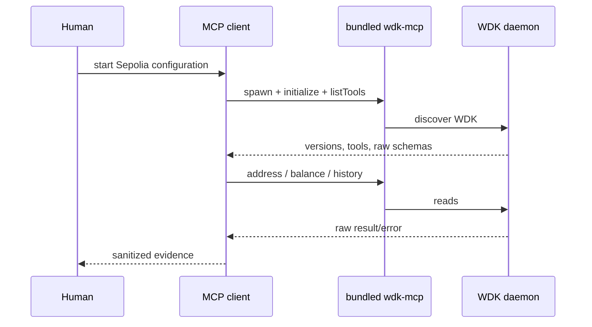
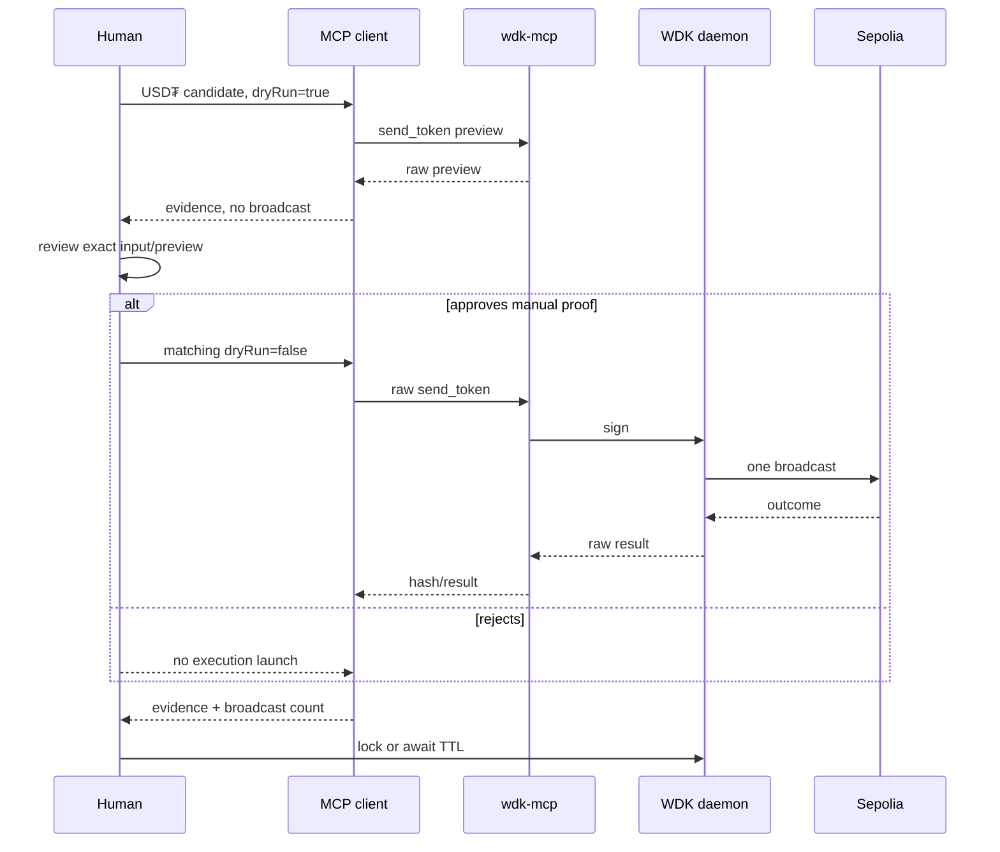

# Design: Developer 1 WDK Blockchain Flow

## Technical Approach

Documentation-only checkout; all implementation paths are **planned** and unverified. Developer 1 owns shared Wave 0 bootstrap plus raw `wdk-mcp` lifecycle, reads, sanitized evidence, and one human-approved testnet proof. API, agent, session, and guardrail implementation remain Developer B scope.

## Architecture Decisions

| Decision | Choice and rationale | Rejected alternative |
|---|---|---|
| Track 1 bootstrap | Shared `package.json`/lockfile set `engines.node: ">=22.18.0"` and exact direct dependencies `@tetherto/wdk@1.0.0-beta.14`, `@tetherto/wdk-cli@1.0.0-beta.2`. The fixed bundled `wdk-mcp` executable is the agent boundary. | Toolkit embedding, floating versions, or parsed CLI output violate Track 1/reproducibility. |
| Process lifecycle | Spawn the fixed executable without shell/user argv, allowlist environment, bound handshake/calls/close/termination, and never retry uncertain broadcasts. Failure closes the client and records evidence. | Unmanaged processes risk duplicate sends. |
| Product asset | Evidence MUST send Sepolia test USD₮; native Sepolia ETH is gas only, never the product-transfer fallback. | Native-asset evidence would not prove the required product flow. |
| Manual proof | The harness captures preview; a human reviews it and launches one matching broadcast. The client only invokes raw tools. Production cap, allowlist, freshness, matching, one-shot, replay, and conversational confirmation belong to Developer B. | MCP-client approval crosses ownership. |
| Evidence | Preserve installed raw schemas/results in sanitized versioned fixtures. | Normalization belongs to Developer B. |

## Components and Data Flow

- `src/wdk/mcp-client.ts` (planned): process lifecycle, raw invocation, evidence.
- `src/wdk/direct-wallet-reads.ts` (planned): raw address/balance/history calls.
- Human CLI: wallet create/unlock/lock with finite TTL, never through MCP.

## Raw Handoff Interface

Fixtures carry `schemaVersion`, `runId`, timestamp, exact Node/WDK/tool versions and schema, network `sepolia`, registered USD₮ identifier, wallet/index, recipient, amount, `baseUnits` semantics, `dryRun`, raw fee/gas fields, raw preview/result/error, and broadcast attempted/count/hash/verification. These raw fields let Developer B derive the spending cap, recipient allowlist, exact candidate matching, and conversational confirmation; Developer 1 emits no policy decision, approval token, or session state. History distinguishes `unavailable|stale|empty|non-empty`; closure records `locked|expired`. API/agent/session/normalized fields are forbidden.

## Failure Handling, Security, and Observability

Events record run, time, stage, duration, version, sanitized outcome, and broadcast status; stdout is MCP-only and diagnostics use stderr. Use a minimally funded wallet, finite TTL, and always lock. Secret material MAY be backed up only by an approved offline wallet-administration procedure, never in repository, fixtures, logs, or evidence. Document same-user daemon access. Never map unavailable/stale history to empty or retry uncertain broadcasts.

## Planned File Changes

| Path | Action |
|---|---|
| `package.json` | Shared Wave 0 engines and exact dependencies |
| `package-lock.json` | Shared reproducible resolution |
| `src/wdk/mcp-client.ts` | Raw lifecycle/invocation/evidence; no guardrails |
| `src/wdk/direct-wallet-reads.ts` | Raw reads |
| `tests/integration/wdk-mcp.test.ts` | Discovery/read/process checks |
| `tests/integration/wdk-transfer.manual.test.ts` | Human-gated USD₮ proof harness |
| `tests/integration/wdk-fixtures/` | Sanitized raw handoff |
| `docs/architecture.md` | Versions, setup, flow, limits, evidence |

## Testing Strategy

Vitest RED cases cover exact bootstrap versions, bundled executable discovery, process failures/timeouts, schema mismatch, wallet/history states, preview non-broadcast, uncertain-broadcast no-retry, secret rejection, and closure. The non-default manual harness records approval, input equality, Sepolia USD₮, gas-only ETH, and at most one broadcast per evidence run. No executable verification is claimed.

## Threat Matrix

| Boundary | Applicability | Response | RED tests |
|---|---|---|---|
| Documentation-like paths | N/A: no executable-path classification | Fixed bundled executable | None |
| Git repository selection | N/A: no Git selection | No VCS automation | None |
| Commit state | N/A: no commits | No index semantics | None |
| Push state | N/A: no pushes | No ref resolution | None |
| PR commands | N/A: no PR automation | No composition | None |

## Migration and Rollout

No data migration. Apply shared bootstrap, discovery/reads, preview, one approved broadcast, evidence verification, then lock; abort and lock on failure. Same-branch delivery with the user-accepted size exception is authorized. Rollback removes planned files and retires demo-wallet state. Tasks still need RPC, indexer capability, funded sender, controlled recipient, and explorer.
