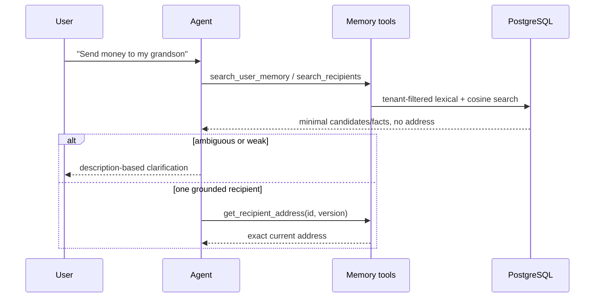
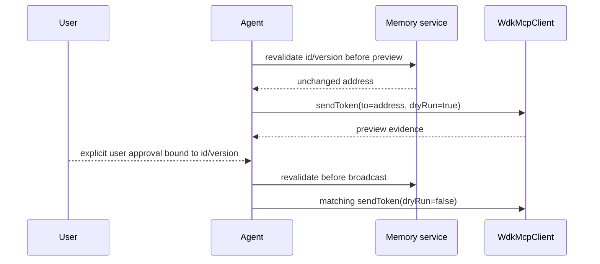

# Design: Recipient Address Memory

## Technical Approach

The repository implements only the WDK boundary in `src/wdk/`; Fastify, the agent runtime, and persistence are planned. Add one PostgreSQL+pgvector store behind a user-scoped memory service. Semantic search generates candidates from names, descriptions, and confirmed relationship facts; only a resolved, versioned recipient can reveal its exact address to the existing `WdkMcpClient.sendToken` flow.

## Architecture Decisions

| Decision | Choice and rationale | Alternatives considered |
|---|---|---|
| Store and deployment | PostgreSQL with `vector`, configured by `DATABASE_URL`. Hackathon deployment uses `compose.yaml`, a local pgvector container, and named volume beside the backend/WDK daemon. A hosted pgvector-compatible PostgreSQL changes only the URL. One store avoids synchronization. | Qdrant/Pinecone add credentials and dual-write failure modes. |
| Records | `recipients(id UUID, user_id UUID, name, normalized_name, description, address, version BIGINT, status, embedding vector(384), embedding_model_revision, provenance JSONB, address_confirmed_at, created_at, updated_at)` and `user_memories(id UUID, user_id UUID, fact, kind, version, status, embedding vector(384), embedding_model_revision, provenance JSONB, confirmed_at, created_at, updated_at)`. Recipient embeddings contain only normalized `name + description`; addresses remain exact relational payloads. | Embedding addresses risks disclosure and cannot provide exact identity. |
| Embeddings/search | Pin `@huggingface/transformers` and `sentence-transformers/paraphrase-multilingual-MiniLM-L12-v2` (384 dimensions, multilingual Spanish). Pre-fetch and persist the model cache; require no embedding credential. Exact cosine search, B-tree `(user_id,status,normalized_name)`, and an exact-name lexical boost produce deterministic hybrid ranking. | HNSW is deferred while per-user sets are small; add tenant partitioning/HNSW only after measured scale. |
| Tenant security | Fastify authentication supplies `userId`; tools never accept it. Every repository query includes `WHERE user_id = $1`, while each transaction sets `SET LOCAL app.user_id` and PostgreSQL RLS enforces the same scope for a non-`BYPASSRLS` application role. | Prompt/tool-argument tenant IDs are forgeable; application filtering alone lacks defense in depth. |
| Resolution safety | Search returns evidence, score, stable ID, and version, never address. Session state records the chosen ID/version and explicit confirmation. Address resolution and version are revalidated before preview and again before confirmation/broadcast. | Similarity threshold alone cannot prove identity. |

## Components and Planned Files

| Path | Action and responsibility |
|---|---|
| `compose.yaml`, `src/db/client.ts`, `src/db/migrations/001_recipient_memory.sql` | Local database, connection/transaction context, extension, tables, indexes, RLS. |
| `src/memory/{embedding,repository,service,tools}.ts` | Model lifecycle, tenant queries, ranking, confirmation-gated writes, tool contracts. |
| `src/agent/transfer-orchestrator.ts`, `src/api/server.ts` | Intent/session binding, disambiguation, revalidation, WDK handoff. |
| `tests/{unit,integration,e2e}/recipient-memory*` | Ranking, isolation, persistence, conversation and transfer safety. |

## Interfaces

```ts
search_recipients({ query }): Candidate[] // id, version, name, description, evidence, score
search_user_memory({ query }): Fact[]     // id, fact, evidence, score
write_user_memory({ draft, confirmationId }): WriteResult
get_recipient_address({ recipientId, expectedVersion }): { recipientId, version, address }
```

The server injects authenticated user/session/confirmation state. `get_recipient_address` rejects unresolved IDs, stale versions, inactive records, invalid addresses, or foreign ownership.

## Data Flow





## Failure, Security, and Observability

Database/model failure, no match, conflicting facts, weak ranking, stale version, or invalid record stops before preview; writes are atomic and rejected without exact confirmation. Logs omit queries, facts, descriptions, and addresses. Structured events/metrics record operation, latency, candidate count, ambiguity, embedding revision, RLS denial, stale-version rejection, and sanitized outcome. Existing WDK no-retry/uncertain-broadcast behavior remains unchanged.

## Testing Strategy

Unit tests cover normalization, lexical boost, score/ambiguity policy, tool redaction, and confirmation gates. PostgreSQL integration tests prove RLS plus explicit tenant filters, exact cosine ordering, address exclusion, atomic writes, and optimistic-version failures. E2E tests cover `Lucas`, `Lucas the electrician`, `my grandson`, clarification, model/DB failure, changed/deleted records, exact `to`, preview, and revalidation before broadcast. Existing explicit-address WDK tests remain green.

## Threat Matrix

N/A — this design adds no routing, shell, subprocess, VCS/PR automation, executable classification, or process-lifecycle behavior; it calls the existing WDK client without changing that boundary.

## Migration and Rollout

Create `vector`, tables, indexes, policies, and restricted role; pre-fetch the pinned model; seed only confirmed records with embeddings. Roll out behind a recipient-memory feature flag, then enable reads, confirmed writes, and transfer handoff in stages. Empty/new tables require no legacy migration. Rollback disables tools and preserves explicit-address transfers; the volume remains for approved export/deletion. Scaling may later add partitioning/HNSW without changing tool contracts.

## Open Questions

- None blocking task planning; deployment must supply an authenticated user principal and decide the feature-flag mechanism.
