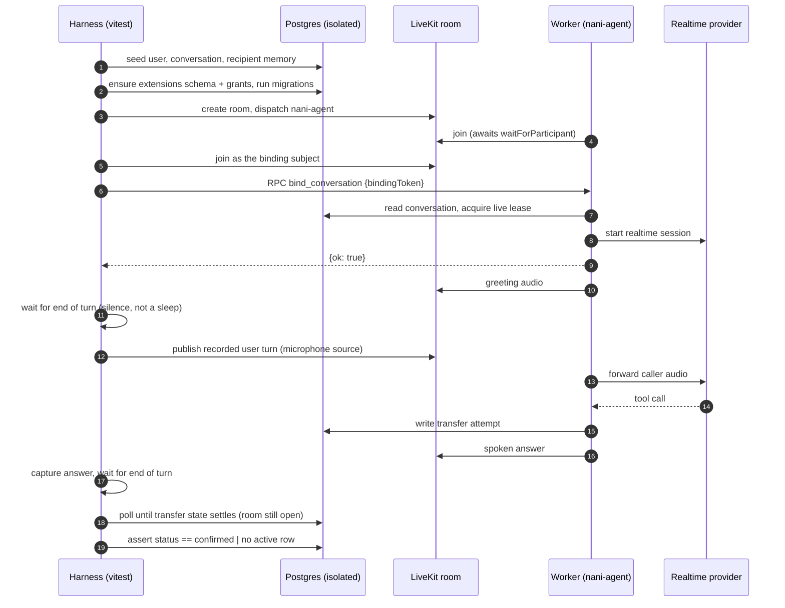

# Design

## The layer this covers

Three layers exist and must not be confused:

1. **Model** — does the realtime model understand and answer? Covered by
   `evals/voice/realtime/`.
2. **System** — does the worker start on a real binding, does media cross in both
   directions, do tools execute against the real backend, does the conversation
   end in the expected state? **This change.**
3. **Product** — can an older adult complete a transfer unaided? Not covered
   here, and not automatable.

## Sequence

## Decisions

| Decision | Choice | Rationale |
|---|---|---|
| Harness location | `tests/e2e/voice-room/` | It is a system test, not a scored eval. |
| Runner | vitest, own config | Already the repository's runner; inherits its conventions, excluded from `npm test` because it needs a live stack and paid credentials. |
| Caller audio | Committed pre-recorded WAVs | Deterministic input is the only way to ask "did the model hear *veinticinco* and not *25*". Keeps per-run cost and variance out of the stack. |
| Turn boundary | Silence detection, pure function | A fixed sleep is simultaneously too slow on a good run and too short on a bad one. The detector is unit-tested independently. |
| Backend assertion point | `conversation_transfer_attempts.status` | The single source of truth for whether a transfer happened. Asserting that the agent spoke cannot distinguish a transfer that happened from one that was narrated and never broadcast. |
| Barge-in trigger | The application's `interrupt_agent` RPC | In this product barge-in is a deliberate user action, not acoustic detection. The RPC is the contract the UI depends on. |
| Stack isolation | Own compose project, own RTC port range | The base ports are occupied on a working machine, and stopping someone else's stack to run tests is not acceptable. |
| Credentials | Injected explicitly | The root isolation setup deletes them on purpose; opting back in must be deliberate. |
| Wallet | Fixture, explicit opt-in flag | The worker had no fixture wallet path: it fell through to a fail-closed provider, and the only alternative made a real provider call. |

## Why a dedicated LiveKit config

LiveKit advertises its RTC range from **its own config file**, not from the compose
port mapping. Remapping host ports while the server keeps announcing the previous
range hands peers unreachable ICE candidates and the call produces no audio without
erroring. Each isolated stack therefore owns a config file with its own range:

| Stack | Config | RTC range |
|---|---|---|
| base | `docker/livekit.yaml` | 7881-7891 |
| privy | `docker/privy-livekit.yaml` | 17881-17891 |
| e2e | `docker/e2e-livekit.yaml` | 38881-38891 |

## Why settlement is not a sleep

A spoken confirmation is not a settled transfer. The agent acknowledges quickly,
but the work that moves money outlives the turn. Tearing the room down when the
answer goes quiet aborted the broadcast mid-flight and left the row at
`previewed` — indistinguishable from an agent that never acted. The scenario
therefore polls the real state with the room still open, on the same principle as
the turn detector: settle on the signal, never on a timer.

## Deviations recorded

- **`src/` was touched twice**, which the original plan did not anticipate. The
  fixture-wallet seam is required because the worker has no fixture wallet path at
  all; it is off by default and covered by unit tests. The vitest config change is
  one exclusion glob. Both are separate, revertible commits.
- **The barge-in scenario duplicates ~40 lines of setup** from the shared runner
  rather than extending it. The runner waits for each turn to end, and this
  scenario must interrupt while the agent is still speaking. Duplication was
  preferred over complicating the control flow every passing test depends on.
- **`openspec/` came after implementation.** The design work happened in
  `.agent-workflow/` as the repository's stage 1 requires; this record was written
  on completion so the change is discoverable where the repository keeps its
  changes.
